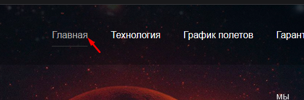
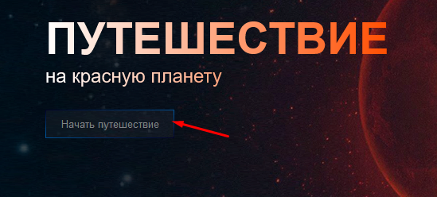
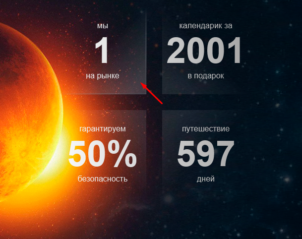
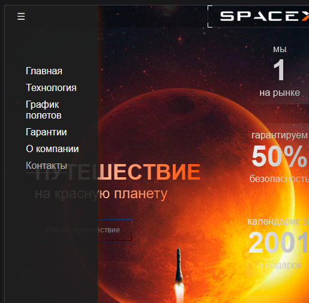
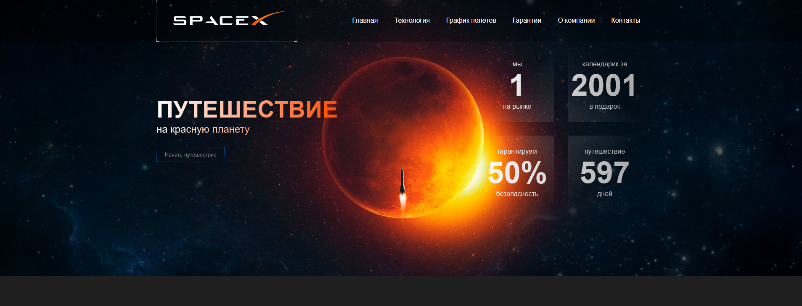
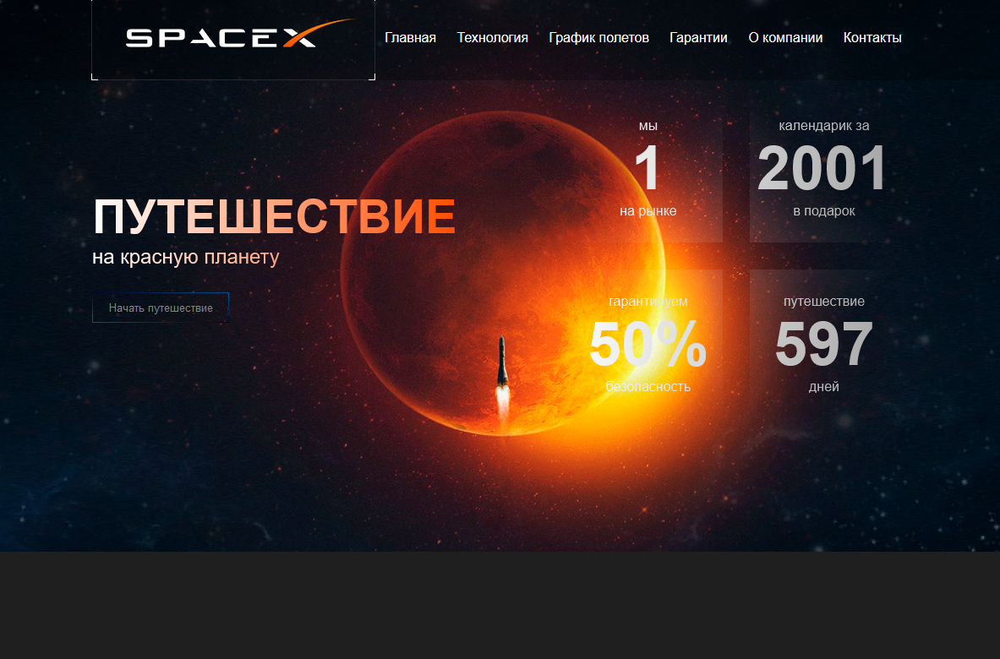
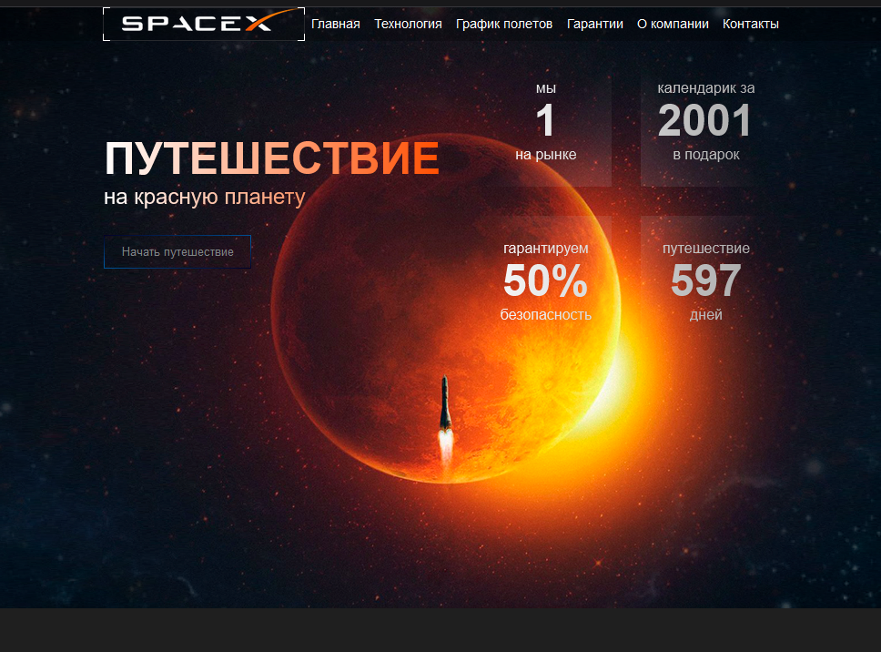
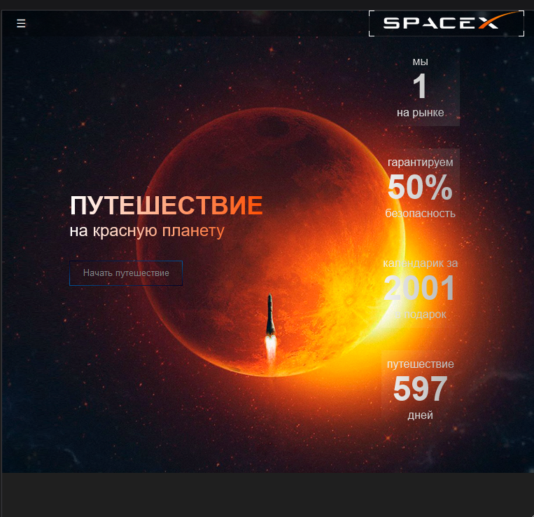
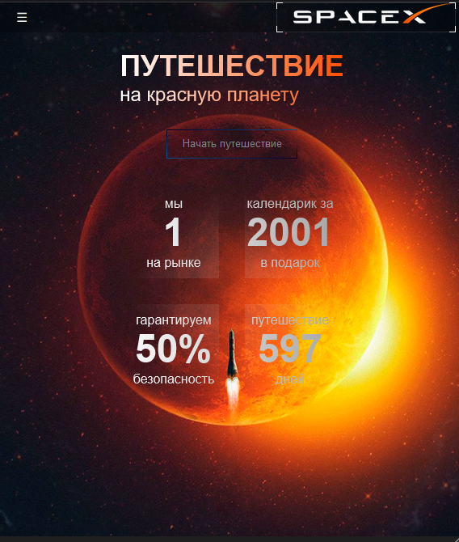

# Adaptive layout - spaceX

Demo
-
> https://cloud-art.github.io/layout-spaceX/

Product comparison page build using **html** + **css**

Animations
-

`Header` animation 

`Button` animation

`Main info` animation

`Hamburger menu`

View with different resolutions
-

View with `width = 1920`

View with `width = 1199`

View with `width = 990`

View with `width = 766`

View with `width = 574`

